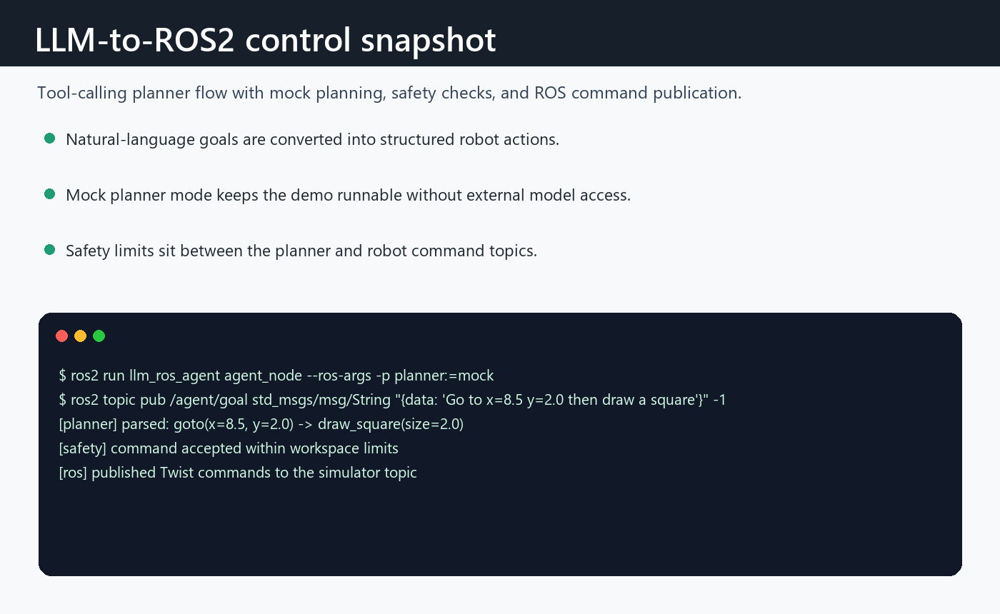

# LLM-to-ROS2 Robot Control Agent (Turtlesim + Gazebo Demo)

This project is a **minimal, inspectable** example of connecting a language-model "planner" to a ROS2 robot **safely** via **tool-calling**.
It runs out-of-the-box with **turtlesim** and now includes a **Gazebo differential-drive robot** so the same tool API can drive a more realistic simulator.
The architecture is structured so the backend can later map to real robot stacks (Nav2 / MoveIt2) with only tool-implementation changes.

## Why this project matters
- **Tool-calling architecture** (LLM plans -> validated tool call -> deterministic execution).
- **Safety layer**: allowlist tools + schema validation + bounds/speed limits + retries/timeouts.
- **Observations**: pose/state feedback; loop supports re-planning.
- **Logging**: JSONL logs for debugging and evaluation.
- **LLM optional**: ships with a **mock LLM** that parses natural language into tool calls (no API keys).
  You can later plug in any real LLM by implementing `BasePlanner`.

---

## Demo A (ROS2 + turtlesim)

### 1) Build
```bash
# ROS2 Humble (or similar) assumed
mkdir -p ~/ws_llm_ros/src
cd ~/ws_llm_ros/src
# copy this repo folder here as llm_ros_agent
colcon build --symlink-install
source ~/ws_llm_ros/install/setup.bash
```

### 2) Run turtlesim + agent
Terminal A:
```bash
ros2 run turtlesim turtlesim_node
```

Terminal B:
```bash
ros2 run llm_ros_agent agent_node --ros-args -p planner:=mock
```

### 3) Send a goal (natural language)
Terminal C:
```bash
ros2 topic pub /agent/goal std_msgs/msg/String "{data: 'Go to x=8.5 y=2.0 then draw a square of size 2'}" -1
```

Try more:
- `Go to 5 5`
- `Draw a square size 3`
- `Tell me your pose`
- `Set pen blue width 4`
- `Go to 9 9 but stay inside bounds`

---

## Demo B (ROS2 + Gazebo Classic)

Install Gazebo ROS packages if they are not already present:
```bash
sudo apt install ros-$ROS_DISTRO-gazebo-ros-pkgs ros-$ROS_DISTRO-gazebo-plugins ros-$ROS_DISTRO-robot-state-publisher
```

Launch Gazebo, spawn the demo robot, and start the agent:
```bash
ros2 launch llm_ros_agent agent_gazebo.launch.py
```

Send a goal:
```bash
ros2 topic pub /agent/goal std_msgs/msg/String "{data: 'Go to x=2.0 y=-1.5 then draw a square of size 1'}" -1
```

The Gazebo backend uses:
- `/demo_bot/cmd_vel` for velocity commands
- `/demo_bot/odom` for pose feedback
- bounds `[-5.0, 5.0]` by default

You can also run the agent against another Gazebo robot by overriding topics:
```bash
ros2 run llm_ros_agent agent_node --ros-args \
  -p backend:=gazebo \
  -p cmd_vel_topic:=/my_robot/cmd_vel \
  -p odom_topic:=/my_robot/odom \
  -p bounds_min:=-5.0 \
  -p bounds_max:=5.0
```

---

## Architecture

**Planner (LLM or mock)** proposes a JSON tool call:
```json
{"tool":"go_to","args":{"x":8.5,"y":2.0},"reason":"Navigate to target."}
```

The agent then:
1) **Validates** tool name + argument schema
2) **Applies safety constraints** (bounds, max speed, max duration)
3) **Executes deterministically** via ROS2 (publish cmd_vel, read pose)
4) Logs results & updates state

```
User Goal -> Planner -> ToolCall(JSON) -> Validator -> Safety -> ROS2 Executor -> Observation -> (loop)
```

### Tools included
- `go_to(x, y, theta=None)`
- `draw_square(size)`
- `say_pose()`
- `set_pen(r, g, b, width, off)`

Backends:
- `turtlesim`: publishes `/turtle1/cmd_vel`, reads `/turtle1/pose`, uses `/turtle1/set_pen`
- `gazebo`: publishes `/demo_bot/cmd_vel`, reads `/demo_bot/odom`, treats `set_pen` as a safe no-op

---

## Extending to real robots
- Replace `tools_turtlesim.py` with tools that call:
  - **Nav2**: `NavigateToPose` action
  - **MoveIt2**: motion planning services/actions
  - Perception tools (VLM): "locate object" -> pose
- Keep the **same tool schema + safety layer + agent loop**.

---

## Repo layout
- `llm_ros_agent/agent_node.py` : main agent loop (planner + validation + safety + execution)
- `llm_ros_agent/tools_turtlesim.py` : deterministic ROS2 tool implementations
- `llm_ros_agent/tools_gazebo.py` : deterministic Gazebo diff-drive tool implementations
- `llm_ros_agent/schemas.py` : tool JSON schemas
- `llm_ros_agent/safety.py` : bounds/speed/time limits
- `llm_ros_agent/llm/mock.py` : mock planner (no API key required)
- `llm_ros_agent/logging_utils.py` : JSONL logging
- `launch/agent_gazebo.launch.py` : starts Gazebo, spawns the robot, and launches the agent
- `urdf/llm_demo_bot.urdf` : small differential-drive robot model
- `worlds/interview_arena.world` : simple bounded Gazebo arena

---

## Suggested walkthrough
1) Start turtlesim
2) Start agent
3) Publish: "Go to x=8 y=2 then draw a square of size 2"
4) Mention: validation + safety + deterministic execution + logs
5) Explain how `go_to` swaps to Nav2 on a real robot

---

## License
MIT (for interview/portfolio use)

## Command trace



Mock-planner command flow showing natural-language goal parsing, safety checks, and ROS publication.


## Control pipeline notes

- A safe tool-calling boundary between an LLM planner and ROS 2 robot commands.
- Mock planning mode for deterministic demos without external API access.
- Turtlesim and Gazebo launch paths sharing the same action interface.


## Integration limits

- The mock planner is intentionally simple and does not represent full language understanding.
- Real robot use would require stronger safety validation outside the LLM process.
- Next steps: add recorded demo media and hardware-in-the-loop safety tests.

